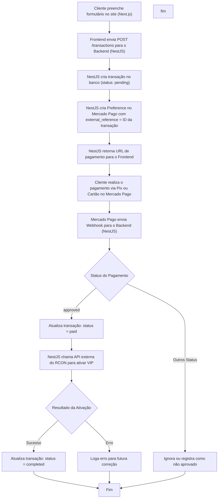

```mermaid
graph TD
    A["Cliente preenche formulário no site (Next.js)"] --> B["Frontend envia POST /transactions para o Backend (NestJS)"]
    B --> C["NestJS cria transação no banco (status: pending)"]
    C --> D["NestJS cria Preference no Mercado Pago com external_reference = ID da transação"]
    D --> E["NestJS retorna URL de pagamento para o Frontend"]
    E --> F["Cliente realiza o pagamento via Pix ou Cartão no Mercado Pago"]
    F --> G["Mercado Pago envia Webhook para o Backend (NestJS)"]
    G --> H{"Status do Pagamento"}

    H -- "approved" --> I["Atualiza transação: status = paid"]
    I --> J["NestJS chama API externa do RCON para ativar VIP"]
    J --> K{"Resultado da Ativação"}

    K -- "Sucesso" --> L["Atualiza transação: status = completed"]
    K -- "Erro" --> M["Loga erro para futura correção"]

    H -- "Outros Status" --> N["Ignora ou registra como não aprovado"]

    L --> O["Fim"]
    M --> O
    N --> O
    fim
```
